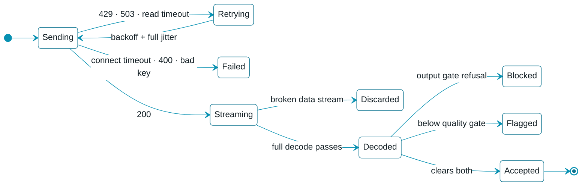
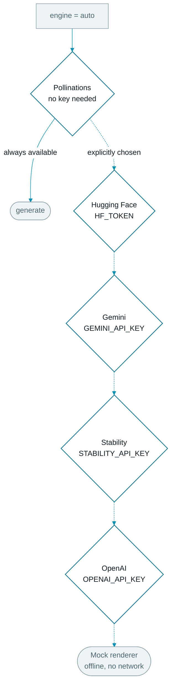
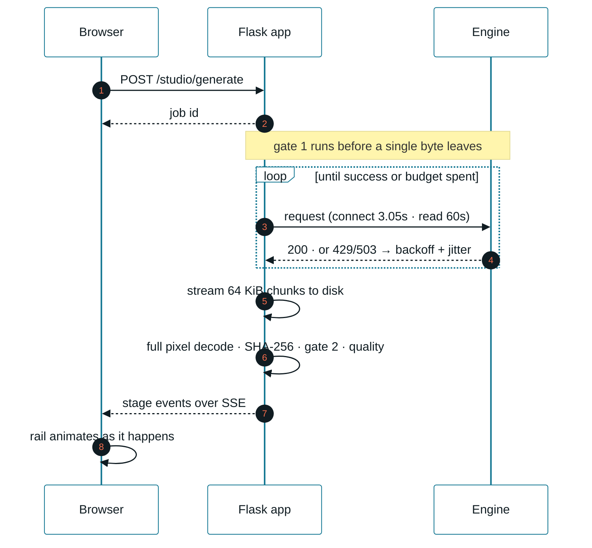

<p align="center">
  
</p>

<h1 align="center">Emulsion</h1>

<p align="center">
  <b>Type a description. Get an image.</b><br/>
  Everything in between — the payload, the retries, the bytes, the checks — stays on screen.
</p>

<p align="center">
  
  
  
  
</p>

<p align="center">
  <a href="#run-it">Run it</a> ·
  <a href="#the-pipeline">Pipeline</a> ·
  <a href="#when-things-go-wrong">Failure handling</a> ·
  <a href="#engines">Engines</a> ·
  <a href="#deploy">Deploy</a> ·
  <a href="#api">API</a>
</p>

<br/>

<p align="center">
  
</p>

<br/>

## Run it

```bash
pip install -r requirements.txt
python app.py
```

<http://127.0.0.1:5000> — **no key, no signup, no `.env`.** The default engine is
free and keyless.

<br/>

## The pipeline

Seven stages, each a module, each reporting its own state to the rail in the UI.

```mermaid
%%{init: {'theme':'base','themeVariables':{'primaryColor':'#ffffff','primaryTextColor':'#101c22','primaryBorderColor':'#0e7490','lineColor':'#0891b2','secondaryColor':'#eef3f6','tertiaryColor':'#f5f7f9','fontFamily':'ui-monospace, Consolas, monospace'}}}%%
flowchart LR
    IN(["prompt · style · ratio"]) --> S1["1 · Payload<br/>exact pixel sizes"]
    S1 --> S2["2 · Input gate<br/>0 compute spent"]
    S2 --> S3["3 · Gateway<br/>split timeout"]
    S3 --> S4["4 · Transport<br/>64 KiB to disk"]
    S4 --> S5["5 · Integrity<br/>full pixel decode"]
    S5 --> S6["6 · Output gate<br/>refusals, blank frames"]
    S6 --> S7["7 · Quality<br/>aesthetic + alignment"]
    S7 --> OUT(["gallery · manifest"])

    classDef s fill:#ffffff,stroke:#0e7490,stroke-width:1.5px,color:#101c22;
    classDef e fill:#eef3f6,stroke:#8398a1,color:#4b6570;
    class S1,S2,S3,S4,S5,S6,S7 s;
    class IN,OUT e;
```



| Stage | File | What it actually does |
|---|---|---|
| 1 · Payload | `params.py` `styles.py` | Maps "wallpaper" to `768 × 1344`. Every bucket is a multiple of 64 at ~1 MP |
| 2 · Input gate | `moderation.py` | Rejects locally, **before** spending GPU time |
| 3 · Gateway | `transport.py` | `timeout=(3.05, 60)`, jittered backoff, status-selective retry |
| 4 · Transport | `transport.py` | `stream=True` → 64 KiB chunks → disk. 64 MiB ceiling |
| 5 · Integrity | `integrity.py` | Forces a full pixel decode. Catches truncated files |
| 6 · Output gate | `moderation.py` | Refusal codes, and the blank frame engines return instead of saying no |
| 7 · Quality | `qa.py` | Aesthetic 0–10 + prompt alignment, gate configurable |

<br/>

## When things go wrong

Most of this project is failure handling. Nothing silently succeeds.



**The one worth knowing about.** `Image.verify()` only reads the header. A JPEG
whose download died halfway through passes it — and lands in your library as a
grey half-image. `Image.open(path).load()` decodes every pixel and raises instead.

| | `verify()` | `.load()` |
|---|---|---|
| Truncated **JPEG** | ✅ passes — *the silent failure* | ❌ `broken data stream` |
| Truncated **PNG** | ❌ catches it | ❌ catches it |

Both are discarded before they reach the gallery, with a SHA-256 and a reason
recorded either way.

<br/>

## Engines



| Engine | Key | Cost |
|---|---|---|
| **Pollinations (Flux)** | none | **free** — default |
| Mock renderer | none | free, offline |
| Hugging Face · FLUX.1-schnell | `HF_TOKEN` | free token, metered |
| Google Gemini | `GEMINI_API_KEY` | **paid** — image models are not on Google's free tier |
| Stability AI | `STABILITY_API_KEY` | paid |
| OpenAI gpt-image-1 | `OPENAI_API_KEY` | paid + org verification |

A wrong key says *invalid key*, not *rephrase your prompt* — 401, 402, 403 and 429
are classified separately and routed to the network stage, never the moderation gate.

<br/>

## Your keys stay yours

Paste a key into **API keys** and it is stored in **your browser only**.

- No database, no session, no server-side file. There is nowhere to leak from.
- Sent with the one request that uses it, then dropped. Never cached.
- Every response is scrubbed for `sk-…`, `hf_…`, `AIza…` — an engine that echoes
  your Authorization header back in an error cannot leak it into the log.
- Never written to `manifest.jsonl`. Provenance records the engine, never the key.

<br/>

## Under the hood



On a serverless host the job registry and SSE cannot work — the POST and the GET
land on different instances. There, `/studio/config` reports `streaming: false`
and the whole batch runs inside one request, returning its event log for the
browser to replay through the same handlers. The rail still animates.

<br/>

## Deploy

```bash
vercel deploy
```

No environment variables required. `GET /studio/health` reports how the request
was routed, whether the templates were bundled, and where assets are written —
one request tells you if a bad deploy is routing or bundling.

> **Why `/studio` and not `/api`** — `/api/*` belongs to Vercel. It answers 404 for
> any `/api` URL without a matching file in `api/`, *before* your rewrite is
> consulted. Both prefixes are registered; the browser uses the one the platform
> does not own.

<br/>

## API

Every route answers on **`/studio/…`** and `/api/…` alike.

| Route | |
|---|---|
| `GET /studio/health` | liveness, routing, bundling |
| `GET /studio/config` | ratios, styles, engines, transport profile |
| `POST /studio/engines` | re-read availability with the caller's keys |
| `POST /studio/keys/validate` | test a key without spending a generation |
| `POST /studio/generate` → `GET /studio/jobs/<id>/events` | streaming (local) |
| `POST /studio/generate/sync` | single request (serverless) |
| `GET /studio/history` | manifest + library stats |
| `GET /assets/<file>[/download]` | stored image |

<br/>

## Layout

```
emulsion/
├── app.py                 # python app.py
├── run.py                 # same pipeline, CLI
├── api/index.py           # Vercel entrypoint
├── imagestudio/
│   ├── params.py          # 1 · ratios, payload validation
│   ├── styles.py          # 1 · presets, negative composition
│   ├── moderation.py      # 2 + 6 · input and output gates
│   ├── transport.py       # 3 + 4 · timeouts, backoff, chunked stream
│   ├── integrity.py       # 5 · forced pixel decode
│   ├── qa.py              # 7 · aesthetic + alignment
│   ├── storage.py         # library, manifest, writable-root probing
│   ├── redact.py          # key scrubbing
│   ├── engine.py          # orchestrator
│   └── providers/         # pollinations · hf · gemini · stability · openai · mock
├── webapp/                # Flask + the studio UI
├── tests/                 # 54 offline tests
└── docs/                  # README artwork
```

```bash
python -m pytest tests -q
```

54 tests, fully offline — the mock engine exercises every stage without a key, a
quota or a network connection.

<br/>

---

<p align="center">
  <sub><b>CLI:</b> <code>python run.py "a brass orrery on a walnut desk" --ratio 16:9 --style photoreal -n 3</code></sub><br/>
  <sub><code>--engines</code> · <code>--presets</code> · <code>--history</code></sub>
</p>
