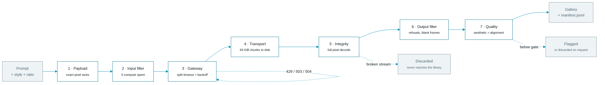

<p align="center">
  
</p>

<p align="center">
  
  
  
  
  
</p>

<h1 align="center">Emulsion</h1>

<p align="center">
  <b>Type a description. Get an image.</b><br/>
  Every step in between — the payload, the retries, the bytes, the checks — stays visible.
</p>

<p align="center">
  <a href="#quick-start">Quick start</a> &nbsp;·&nbsp;
  <a href="#how-a-request-travels">How it works</a> &nbsp;·&nbsp;
  <a href="#engines">Engines</a> &nbsp;·&nbsp;
  <a href="#bring-your-own-key">Your keys</a> &nbsp;·&nbsp;
  <a href="#deploying">Deploy</a> &nbsp;·&nbsp;
  <a href="#http-api">API</a>
</p>

---

## The interface

<p align="center">
  
</p>

A composer on the left, the pipeline rail across the top, and the work surface
everywhere else. The rail is not decoration — each dot is a real stage reporting
its own state as the batch runs, so a slow queue looks like progress instead of a
frozen spinner. Results, the raw request trace, and the whole library sit behind
three tabs on the same surface.

---

## Quick start

```bash
pip install -r requirements.txt
```

```bash
python app.py
```

Open <http://127.0.0.1:5000> and generate. **No `.env`, no signup, no key.**

<details>
<summary><b>Command line, tests, and configuration</b></summary>

<br/>

The same pipeline without the browser:

```bash
python run.py "a brass orrery on a walnut desk, morning light" --ratio 16:9 --style photoreal -n 3
```

```bash
python run.py --engines
```

```bash
python run.py --presets
```

```bash
python run.py --history
```

The test suite is fully offline — the mock engine exercises every stage without a
key, a quota, or a network connection:

```bash
python -m pytest tests -q
```

Configuration is entirely optional. Copy `.env.example` to `.env` and fill in one
line to switch engines; every variable has a working default.

| Variable | Default | Effect |
|---|---|---|
| `IMAGESTUDIO_PROVIDER` | `auto` | Engine to use, or `auto` to pick the first usable one |
| `IMAGESTUDIO_BUDGET_SECONDS` | `0` local, `52` serverless | Wall-clock ceiling for the retry shield |
| `IMAGESTUDIO_ASSETS` | `./assets` | Where images and the manifest are written |

</details>

---

## Engines

The default engine is **Pollinations (Flux)** — free, keyless, no signup. Every
other engine is optional, and adding one is a single environment variable or a
paste into the in-browser vault.

| Engine | Key | Cost | Where to get it |
|---|---|---|---|
| **Pollinations (Flux)** | **none** | **free** | — *(default)* |
| Offline Mock Renderer | none | free | — *(renders locally, no network)* |
| Hugging Face — FLUX.1-schnell | `HF_TOKEN` | free token, metered credits | [huggingface.co/settings/tokens](https://huggingface.co/settings/tokens) |
| Google Gemini | `GEMINI_API_KEY` | paid — image models are **not** on the free tier | [aistudio.google.com/app/apikey](https://aistudio.google.com/app/apikey) |
| Stability AI — Stable Image Core | `STABILITY_API_KEY` | paid | [platform.stability.ai](https://platform.stability.ai/account/keys) |
| OpenAI gpt-image-1 | `OPENAI_API_KEY` | paid, plus org verification | [platform.openai.com](https://platform.openai.com/api-keys) |

`auto` walks that list and picks the first engine that is actually usable, so a
key is the only step needed to switch.

Wrong keys fail usefully rather than generically. `classify_auth_error` separates
*invalid key* (401) from *forbidden* (403), *out of credit* (402) and *rate
limited* (429), and routes a credential failure to the network stage rather than
the moderation gate — telling someone to rephrase their prompt when their key
expired would be actively misleading. The failing card offers an **Add key**
button that opens the vault on the right row.

---

## How a request travels



Each stage is a module, and each emits an event, which is why the rail in the UI
can animate the run as it actually executes instead of after the fact.

---

## The seven stages

<details>
<summary><b>1 · Prompt payload formulation</b> — <code>imagestudio/params.py</code>, <code>styles.py</code></summary>

<br/>

User intent ("make it a wallpaper") is mapped to **exact resolution variables**
before anything is transmitted, because passing unsupported dimensions causes an
immediate API handshake failure.

| Ratio | Resolution | Pixel volume | Target |
|---|---|---|---|
| 16:9 | 1344 × 768 | 1,032,192 | Web banners, presentations |
| 1:1 | 1024 × 1024 | 1,048,576 | Avatars, product grids |
| 9:16 | 768 × 1344 | 1,032,192 | Mobile reels, wallpapers |
| 4:3 · 3:4 · 3:2 · 2:3 · 21:9 | — | ~1.0 MP each | Slides, posters, prints, film stills |

Every bucket is a multiple of 64 at roughly one megapixel — the sizes diffusion
backends are natively trained on. Twelve **style presets** (cyberpunk, minimalism,
photoreal, blueprint, film-noir, vaporwave, …) expand a single word into a full
stylistic vector on both the positive and negative prompt, and a base negative
strips watermarks and obvious artifacts from every request.

Generation count and a seed make batches reproducible: one seed deterministically
derives the whole batch.

</details>

<details>
<summary><b>2 · Network API gateway</b> — <code>imagestudio/transport.py</code></summary>

<br/>

`requests` applies **no timeout by default**, which means a dropped remote
connection hangs the program forever, drains TCP resources, and locks the UI
without surfacing an exception. Every call here passes the split tuple:

```python
requests.post(url, payload, timeout=(3.05, 60))
```

* **Connect timeout 3.05 s** — establishes the TCP connection; the 0.05 s buffer
  absorbs one standard packet retransmission.
* **Read timeout 60 s** — accommodates the slow, iterative diffusion running on
  remote GPU clusters.

The retry shield distinguishes the two failure modes exactly:

| Exception | Diagnosis | Rule applied |
|---|---|---|
| `ConnectTimeout` | Cannot establish TCP — routing, firewall, or downed server | **Fail fast. Do not wait.** |
| `ReadTimeout` | Connected, but inference is slow — saturated GPU cluster | Keep alive, retry |

Retries use **exponential backoff with full jitter** (`uniform(w/2, w)`, capped at
30 s) and apply **selectively by HTTP status** — 429, 503, 504 and friends retry;
a 400 does not. `Retry-After` is honoured when the server sends it.

</details>

<details>
<summary><b>3 · Dual security gates</b> — <code>imagestudio/moderation.py</code></summary>

<br/>

* **Gate 1 (pre-generation, input filter)** runs locally before transmission —
  **zero compute cost incurred, instant rejection**, error trace `sentinel_block`.
* **Gate 2 (post-generation, output filter)** interprets a request that already
  burned GPU time: refusal codes, `finish_reason=FILTER`, and the blurred or blank
  **placeholder frame** an engine returns in place of an explicit refusal
  (detected by near-zero contrast and edge energy across a full-size canvas).

Neither gate raises. Both return a verdict, so the app surfaces a readable warning
instead of crashing.

</details>

<details>
<summary><b>4 · Transport protocol</b> — <code>imagestudio/transport.py</code></summary>

<br/>

Never load a high-resolution image entirely into RAM. Responses are requested with
`stream=True` and piped straight to disk via `iter_content(chunk_size=65536)`,
with a 64 MiB ceiling so a runaway stream cannot fill the disk. Engines that
return base64 JSON (`gpt-image`, Gemini) go through the same chunked disk writer,
so every path has one contract.

</details>

<details>
<summary><b>5 · Integrity verification</b> — <code>imagestudio/integrity.py</code> &nbsp;<i>(the interesting one)</i></summary>

<br/>

**The trap:** `imghdr.what()` and `Image.verify()` only read the block structure
and CRC headers at the very beginning of a file. On a JPEG whose connection
dropped mid-download, both report success — a silent, truncated disaster.

**The fix:** `Image.open(path).load()` forces Pillow to decode the entire stream
pixel by pixel. A file cut off short raises `OSError: broken data stream`, and the
pipeline discards the corrupted asset instead of shipping it.

This is verified by test, and the two formats behave differently:

* **JPEG** — scan-based. `verify()` **passes**, `.load()` catches it. This is the
  exact silent failure the stage exists for.
* **PNG** — chunk-structured, so truncation surfaces one readout earlier.

Both are classified `broken_data_stream` and never reach the library. The stage
also sniffs magic bytes (catching an HTML error page saved with a `.png` name),
records a SHA-256, and reconciles the decoded dimensions against what was
requested.

</details>

<details>
<summary><b>6 · Automated quality assurance</b> — <code>imagestudio/qa.py</code></summary>

<br/>

Two lenses, both reported per asset:

* **Aesthetic classification**, scored 0–10 against a configurable gate
  (default 7.0). Assets below it are flagged, and optionally discarded.
* **Semantic alignment**, measuring whether the artwork matches the prompt that
  requested it. Divergent assets are flagged for regeneration.

The scorer runs in **two tiers, and always reports which one produced a score**:

* `clip` — real **CLIP ViT-L/14** embeddings for both lenses. Used automatically
  when `torch` and `transformers` are installed.
* `heuristic` — the always-available fallback and the default. Genuine image
  statistics (Laplacian edge energy, contrast, Hasler–Süsstrunk colorfulness,
  entropy, exposure balance) folded into the same 0–10 scale, with alignment
  measured by checking the prompt's colour, lighting and complexity vocabulary
  against what the pixels actually show.

CLIP is not installed by default because it pulls ~1.7 GB of weights. Uncomment
the two lines in `requirements.txt` to upgrade; the pipeline detects it at
runtime. **A heuristic score is never labelled as a CLIP score.**

</details>

---

## Bring your own key

A key does not have to live on the server. **API keys** in the top bar opens a
vault where anyone using the studio can paste their own key, test it against the
live engine before spending a generation, and unlock that engine instantly.

The privacy model is deliberately simple, because "trust us" is not a design:

* The key is stored in **that browser's `localStorage`** and nowhere else. The
  server has no database, no session, and no file it could write a key to.
* It is sent to the studio's own backend **only in the request that uses it** —
  and only the key for the engine actually selected. It is used and dropped within
  that request; nothing is cached across requests.
* Every string the server sends back passes through `imagestudio/redact.py`, which
  masks both the exact keys it was handed and anything matching a known key shape
  (`sk-…`, `hf_…`, `AIza…`). An engine that quotes your Authorization header back
  inside an error body cannot leak it into the gateway log.
* Nothing is written to `manifest.jsonl` — provenance records the engine, never
  the credential.
* **Remove** erases it from the browser immediately.

---

## Deploying

```bash
vercel deploy
```

`vercel.json` and `api/index.py` are already in the repo; `requirements.txt` is
picked up automatically. No environment variables are required — the deployed
studio runs on Pollinations, and visitors supply their own keys through the vault.

`GET /studio/health` reports the path Flask actually received, how the request was
routed to it, whether the templates and static files made it into the bundle, and
where assets are being written. One request tells you whether a bad deploy is a
routing problem or a bundling problem.

<details>
<summary><b>Why the routing looks the way it does</b> — three platform behaviours, one configuration</summary>

<br/>

Everything is rewritten to the single function at `api/index.py`, and getting the
real URL to Flask takes some care.

**The prefix.** `/api/*` belongs to the platform, not to the app. Vercel matches
that prefix against the files in `api/` and answers **404 for every other `/api`
URL before the rewrite in `vercel.json` is consulted** — which is why a deploy
could serve the page perfectly and still 404 on `/api/config`. The browser
therefore talks to the JSON API at **`/studio/*`**, a prefix Vercel has no opinion
about. Both prefixes are registered (`_mirror_api_namespace()`), so `curl
/api/config` and the test suite keep working locally.

**The path.** Vercel's filesystem routing binds `api/index.py` to exactly one URL,
`/api/index`. Rewriting to `/api/index/<path>` 404s every URL but `/`, because no
function is mounted at those sub-paths; rewriting to a bare `/api/index` does reach
the function, but the build warns that *internal rewrites are routed using the
rewritten destination path*, so Flask is asked for `/api/index` and answers 404 for
the whole site. So the rewrite carries the original path in a `__vpath` query
parameter and the `_RestorePath` WSGI wrapper restores it, falling back to
stripping the mount prefix and then to the path as-given.

**Where that wrapper lives matters more than what it does.** It is applied in
`webapp/app.py`, on the app object, **not** in an entrypoint. Vercel detects Flask
as a backend framework and decides for itself which module to import — the root
`app.py`, `api/index.py`, or neither — so a wrapper guarding one entrypoint guards
nothing. On the app object it covers every entrypoint, plus gunicorn and
`python app.py`, where it is a no-op.

Belt and braces on top: `/` serves the stylesheet and script **inlined**, so the
interface never depends on `/static/*` routing, and if the config call ever does
come back wrong the page says so explicitly instead of rendering an inert shell.

</details>

<details>
<summary><b>What changes on a serverless host</b> — ephemeral disk, no streaming</summary>

<br/>

**The filesystem is read-only apart from `/tmp`.** `storage.py` probes for a
writable root at import and falls back, so nothing crashes; the Library tab shows
an *ephemeral storage* banner and lists what this browser tab generated, held in
memory. Every asset is also returned inline as a data URI, so the gallery never
depends on a second request finding the file on the same instance.

**Each request is its own process.** The POST that starts a job and the GET that
reads its event stream can land on different instances, which makes SSE and the
in-memory job registry unusable. When `VERCEL` is set, `/studio/config` reports
`streaming: false` and the browser calls `POST /studio/generate/sync`, which runs
the batch inside one request and returns the collected event log for the client to
replay through the same handlers. The pipeline still animates; it just animates
after the fact. Batch size drops to 2 so the inlined images fit Vercel's 4.5 MB
response cap, and `IMAGESTUDIO_BUDGET_SECONDS` (52 by default) stops the retry
shield from backing off past the 60 s function ceiling — a throttled engine
reports a readable error instead of a gateway timeout.

</details>

---

## HTTP API

Every route is served under **both** `/studio/…` and `/api/…`. The browser uses
`/studio` because Vercel reserves `/api`; locally either works.

| Route | Purpose |
|---|---|
| `GET /studio/health` | liveness, routing and bundling probe |
| `GET /studio/config` | ratios, styles, engines, stages, transport profile |
| `POST /studio/engines` | re-read engine availability with the caller's keys applied |
| `POST /studio/keys/validate` | probe one key against its engine without generating |
| `POST /studio/generate` → `GET /studio/jobs/<id>/events` | streaming transport (local) |
| `POST /studio/generate/sync` | single-request transport (serverless) |
| `GET /studio/history` | manifest entries plus library stats |
| `GET /assets/<file>[/download]` | stored asset, 404 if this instance never wrote it |

---

## Provenance

Every asset that survives the integrity stage lands in `assets/` as
`{utc-timestamp}_{prompt-slug}_s{seed}_{index}.{ext}`, and one JSON line is
appended to `assets/manifest.jsonl` with the full record: prompt, composed prompt,
exact payload, engine, seed, byte count, chunk count, SHA-256, integrity verdict,
gate verdicts and both quality scores. Rejected assets are recorded too, with their
failure code — the manifest is the audit trail, not just the successes.

---

## A note on what the free engine actually returns

Pollinations honours the aspect ratio but **downscales the long edge**: a request
for 1344 × 768 comes back at 1015 × 580, and 1024 × 1024 comes back at 768 × 768.
The studio does not hide this. The integrity stage reconciles decoded dimensions
against the requested payload and marks the asset with a dimension deviation —
exactly the kind of silent substitution that stage exists to surface.

Engines with exact pixel control (Hugging Face, Stability AI) honour the payload
precisely. Nothing is upscaled or resampled to paper over the difference; the
pipeline reports what actually arrived.

---

## Project layout

```
emulsion/
├── app.py                  # entrypoint: python app.py
├── run.py                  # CLI pipeline
├── api/index.py            # Vercel entrypoint (re-export; routing lives on the app)
├── vercel.json             # maxDuration 60s, everything rewritten to the function
├── requirements.txt
├── .env.example            # every key optional
├── imagestudio/
│   ├── params.py           # Stage 1 - aspect ratio map, payload validation
│   ├── styles.py           # Stage 1 - style presets, negative composition
│   ├── transport.py        # Stage 2 + 4 - split timeout, backoff, chunked stream
│   ├── moderation.py       # Stage 3 - dual security gates
│   ├── integrity.py        # Stage 5 - forced pixel decode
│   ├── qa.py               # Stage 6 - aesthetic + semantic alignment
│   ├── storage.py          # asset library, manifest, writable-root probing
│   ├── redact.py           # scrubs API keys out of anything sent to the browser
│   ├── engine.py           # the orchestrator
│   └── providers/          # pollinations, gemini, huggingface, stability, openai, mock
├── webapp/
│   ├── app.py              # Flask; SSE locally, single-request on serverless
│   ├── templates/index.html
│   └── static/{app.css, app.js}
├── tests/test_pipeline.py  # 54 offline tests
├── docs/                   # README artwork
└── assets/                 # generated artwork + manifest.jsonl
```

---

<p align="center">
  <sub>Built around the parts of text-to-image that are not the model: exact payloads,
  split-timeout network policy, jittered backoff, moderation gates, memory-safe chunked I/O,
  binary integrity verification, automated quality scoring, and per-request credential handling
  with output redaction.</sub>
</p>
